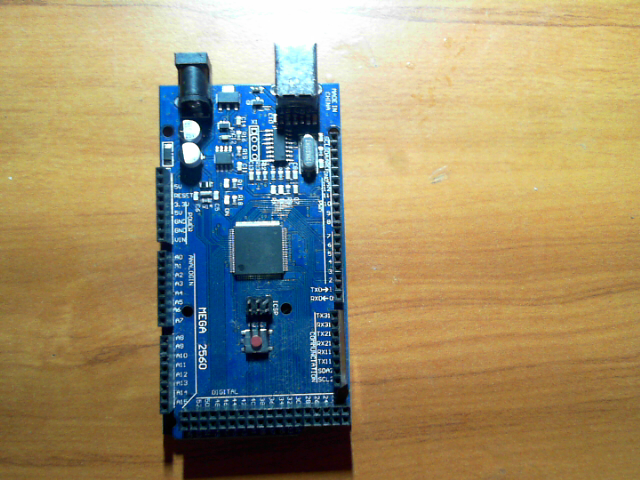
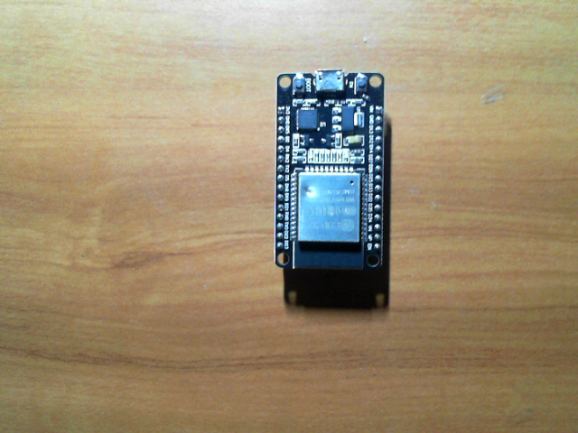
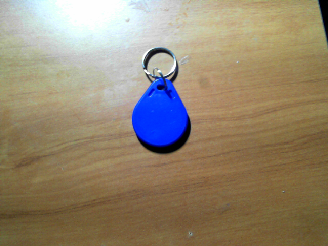
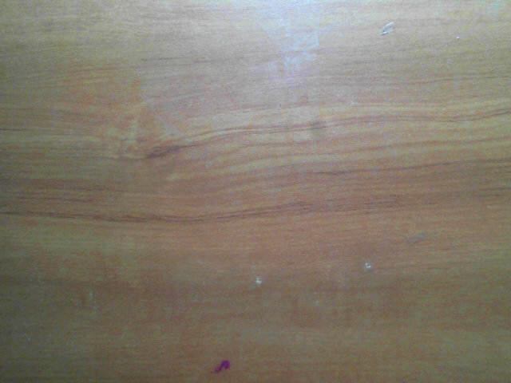
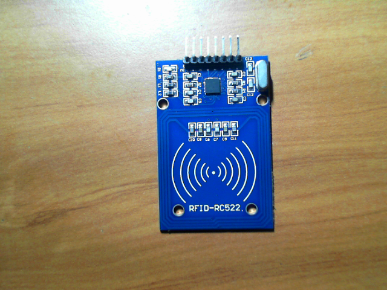

# DESAIN AWAL P2 — TRANSFER LEARNING

**Mata kuliah:** RET503 Computer Vision and Deep Learning  
**Topik:** Transfer Learning dan Fine-Tuning Model Visi  
**Tahap CDIO:** Stage #2 — Design

## 1. Misi proyek

Proyek ini membangun prototipe persepsi berbasis kamera untuk mengklasifikasikan komponen elektronik dan mendeteksi kondisi ketika tidak ada objek target. Model klasifikasi ini menjadi dasar untuk pengembangan persepsi robot pada tahap berikutnya; pengujian saat ini dilakukan pada dataset gambar, belum pada keseluruhan pipeline robot.

## 2. Kelas objek dan contoh citra

Dataset berisi 604 citra dari lima kelas. Contoh di bawah berasal dari `dataset_raw` pada repositori ini.

| Arduino Uno | ESP32 | Kartu RFID | Kosong | RFID-RC522 |
|---|---|---|---|---|
|  |  |  |  |  |
| 99 gambar | 135 gambar | 170 gambar | 50 gambar | 150 gambar |

Setiap kelas memenuhi ketentuan minimal 50 citra. Nama kelas yang digunakan pada kode adalah `arduino_uno`, `esp32`, `kartu_rfid`, `kosong`, dan `rfid_rc522`.

## 3. Kamera dan kalibrasi

Data awal diambil menggunakan webcam laptop pada resolusi **1280 × 720 piksel**. Kalibrasi menggunakan 41 citra checkerboard dan menghasilkan RMS calibration error sebesar **0,5709 piksel**. Parameter kalibrasi disimpan pada `calib.npz`; koreksi distorsi dilakukan oleh `correct_images.py` dan hasil koreksi disimpan terpisah dari data mentah.

**Batasan pencatatan pemasangan:** tinggi kamera, sudut kamera, dan jarak kerja fisik tidak dicatat sebagai bagian dari dataset awal. Nilai-nilai tersebut tidak diperkirakan atau dibuat-buat; ukur dan catat saat webcam dipasang pada dudukan robot untuk uji deployment.

## 4. Unit komputasi

Eksperimen dikembangkan di laptop Windows menggunakan Python, PyTorch, dan torchvision. Training serta uji latency yang dilaporkan menggunakan **CPU**; CUDA tidak digunakan. Detail model CPU, RAM, dan apakah laptop tersambung ke adaptor daya saat pengukuran tidak terekam pada log eksperimen, sehingga tidak dinyatakan sebagai angka terukur.

## 5. Target kinerja

Referensi materi praktikum adalah **15 FPS**, setara sekitar **66,7 ms per frame untuk keseluruhan pipeline**. Pengukuran saat ini hanya mengukur inferensi model pada CPU, bukan akuisisi kamera, preprocessing, postprocessing, atau komunikasi ROS 2. Karena itu angka latency inferensi tidak diklaim sebagai FPS end-to-end robot.

## 6. Kandidat model

| Model | Ukuran model (referensi materi) | Alasan |
|---|---:|---|
| **MobileNetV3-Small** | sekitar 2,5 juta parameter; 0,06 GFLOPs | Ringan, dipilih untuk eksperimen utama pada CPU dan perangkat edge. |
| **EfficientNet-B0** | sekitar 5,3 juta parameter; 0,39 GFLOPs | Kandidat pembanding dengan kebutuhan komputasi lebih tinggi. |

Angka parameter dan GFLOPs di atas merupakan angka referensi materi, bukan pengukuran ulang pada proyek ini. Eksperimen P2 yang dilaporkan menggunakan MobileNetV3-Small.

## 7. Strategi transfer learning

Eksperimen membandingkan tiga mode selama 10 epoch dengan batch size 16, input RGB 224 × 224, normalisasi ImageNet, augmentasi `RandomResizedCrop`, `RandomHorizontalFlip`, dan `ColorJitter`, optimizer Adam, serta scheduler Cosine Annealing.

1. **Feature Extraction:** backbone pretrained ImageNet dibekukan; classifier baru dilatih.
2. **Partial Fine-Tuning:** dua modul feature terakhir dan classifier dilatih; bagian backbone lainnya dibekukan.
3. **Scratch Training:** model dilatih dari bobot awal tanpa bobot pretrained.

## 8. Rencana dan pembagian data

Metadata pada `dataset_raw/metadata.csv` mencatat nama file, kelas, tanggal pengambilan, dan kondisi cahaya. Pengguna mengonfirmasi tanggal pengambilan adalah **6 Oktober 2026**; tanggal pada seluruh 604 baris metadata telah diselaraskan dengan `2026-10-06`.

| Kelas | Training (terang) | Validation (redup) | Total |
|---|---:|---:|---:|
| `arduino_uno` | 49 | 50 | 99 |
| `esp32` | 65 | 70 | 135 |
| `kartu_rfid` | 88 | 82 | 170 |
| `kosong` | 25 | 25 | 50 |
| `rfid_rc522` | 70 | 80 | 150 |
| **Total** | **297** | **307** | **604** |

Pembagian menggunakan kondisi cahaya terang untuk training dan redup untuk validation. Nilai validation harus ditafsirkan sebagai evaluasi lintas kondisi pencahayaan pada dataset yang tersedia, bukan jaminan performa universal pada semua kondisi atau objek baru.

## 9. Risiko dan mitigasi

| Risiko | Mitigasi |
|---|---|
| Overfitting atau performa rendah pada data baru | Gunakan pretrained weights, augmentasi, dan uji tambahan pada citra baru. |
| Perubahan pencahayaan | Evaluasi lintas kondisi; tambah sampel dari jendela, bayangan, dan pencahayaan berbeda. |
| Data leakage atau gambar terlalu mirip | Pisahkan sesi atau kondisi pengambilan dan tinjau contoh validation. |
| Ketidakseimbangan kelas | Pantau jumlah per kelas; tambahkan data bila hasil per kelas menunjukkan kebutuhan. |
| Latency pada perangkat robot lebih tinggi dari uji CPU | Ukur end-to-end latency setelah kamera dan pipeline robot terpasang. |

**Status:** dataset, kelas, model eksperimen, dan protokol training telah ditetapkan. Pengukuran posisi fisik webcam dan evaluasi pipeline end-to-end merupakan pekerjaan lanjutan sebelum deployment.
