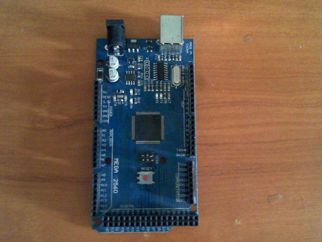
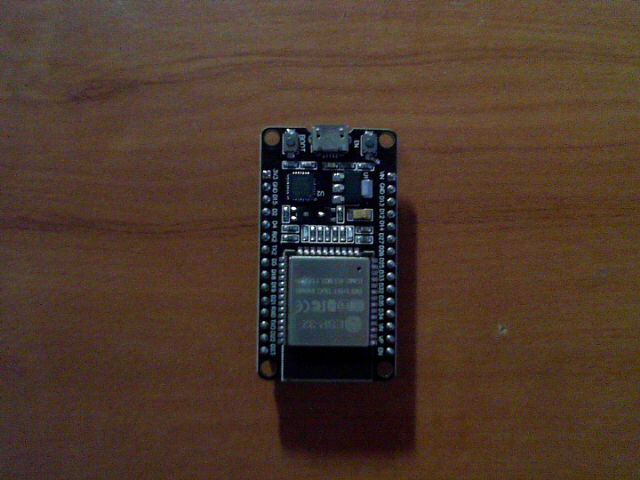
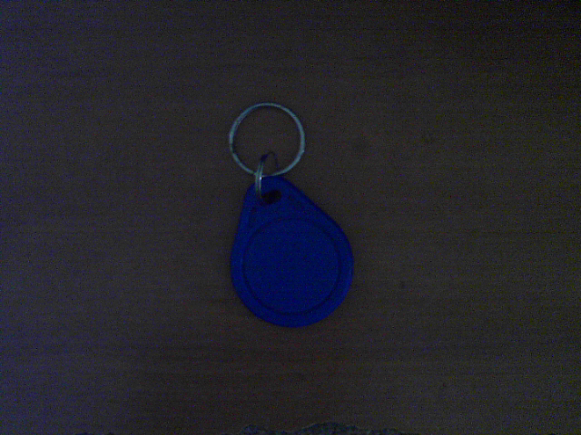
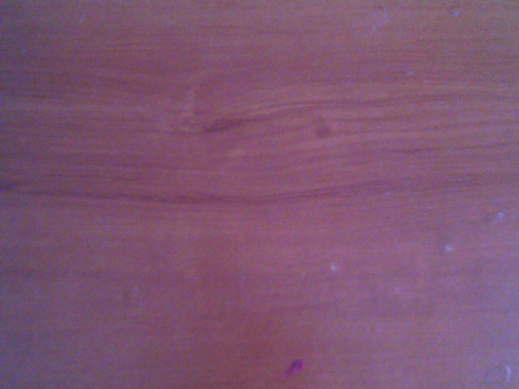
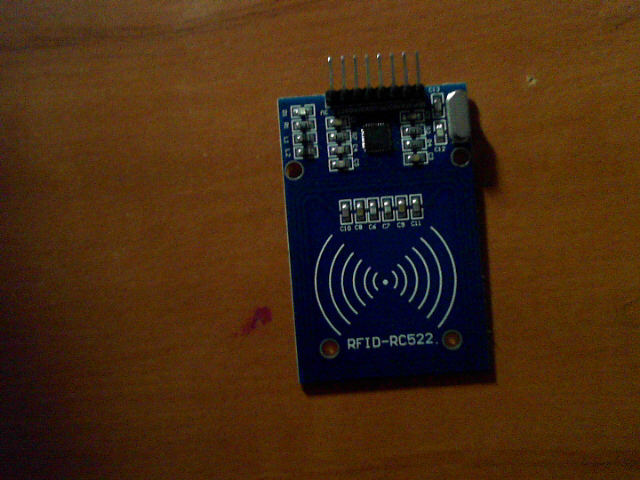

# DESAIN AWAL P2 - TRANSFER LEARNING

**Mata kuliah:** RET503 Computer Vision and Deep Learning  
**Topik:** Transfer Learning dan Fine-Tuning Model Visi  
**Tahap CDIO:** Stage 2 - Design

## 1. Misi proyek dan kelas objek

Proyek ini mengembangkan prototipe klasifikasi visual untuk mengenali empat komponen elektronik (`arduino_uno`, `esp32`, `kartu_rfid`, `rfid_rc522`) dan satu kelas kondisi tanpa objek (`kosong`). Klasifikasi dijalankan menggunakan MobileNetV3-Small dan dibandingkan pada tiga strategi training.

<table>
<tr><td align="center"> Arduino Uno <small>640 x 480 piksel</small></td>
<td align="center"> ESP32 <small>640 x 480 piksel</small></td>
<td align="center"> Kartu RFID <small>640 x 480 piksel</small></td>
<td align="center"> Kondisi tanpa objek <small>640 x 480 piksel</small></td>
<td align="center"> Modul RFID RC522 <small>640 x 480 piksel</small></td></tr>
</table>

| Kelas | Deskripsi | Jumlah citra |
|---|---|---:|
| `arduino_uno` | Board Arduino Uno | 99 |
| `esp32` | Board ESP32 | 135 |
| `kartu_rfid` | Kartu RFID | 170 |
| `kosong` | Tidak ada objek target | 50 |
| `rfid_rc522` | Modul pembaca RFID RC522 | 150 |
| **Total** | | **604** |

## 2. Kamera, kalibrasi, dan dudukan

- **Resolusi citra dataset:** 640 x 480 piksel. Ini adalah ukuran file citra yang tersedia, bukan klaim resolusi sensor kamera.
- **Kalibrasi kamera:** 41 citra checkerboard; RMS calibration error 0.5709 piksel. Parameter kalibrasi disimpan di `calib.npz` dan digunakan oleh pipeline koreksi citra.
- **Jenis kamera dan resolusi akuisisi asli:** belum dicatat secara eksplisit dalam metadata yang tersedia; perlu dikonfirmasi dari konfigurasi kamera/skrip capture.
- **Dudukan, tinggi kamera, sudut, dan jarak kerja:** belum diukur/didokumentasikan sebagai nilai fisik pada eksperimen P2. Ukur saat kamera dipasang pada dudukan robot sebelum deployment; angka tidak diperkirakan di dokumen ini.

## 3. Unit komputasi

| Parameter | Informasi yang terdeteksi saat dokumen dibuat |
|---|---|
| Sistem operasi | Microsoft Windows 11 Home Single Language |
| Model komputer | ASUSTeK COMPUTER INC. Vivobook_ASUSLaptop M3500QC_M3500QC |
| CPU | AMD Ryzen 9 5900HX with Radeon Graphics |
| RAM terpasang | 15,4 GB |
| Python | 3.14.5 |
| PyTorch terpasang saat dokumen dibuat | 2.14.1+cpu |
| torchvision terpasang saat dokumen dibuat | 0.29.1+cpu |
| CUDA tersedia saat dokumen dibuat | Tidak |
| Perangkat eksperimen pada log | CPU |

Log training dan latency eksperimen yang disimpan mencatat perangkat eksperimen sebagai CPU. Informasi sistem di atas dibaca dari komputer ketika dokumen diperbarui; profil daya pada saat training awal tidak direkam terpisah.

## 4. Target kinerja dan kandidat model

Materi referensi menetapkan target sekitar 15 FPS (66.7 ms/frame) untuk seluruh pipeline, bukan inferensi model saja. Pada model Feature Extraction, latency inferensi saja adalah rata-rata **14.869 ms**, median **14.906 ms**, P95 **16.895 ms**, maksimum **27.206 ms**, dengan estimasi **67.25 FPS** pada CPU. Kamera, preprocessing, post-processing, serta komunikasi ROS 2 belum diukur sebagai satu pipeline utuh.

| Kandidat | Alasan pemilihan |
|---|---|
| MobileNetV3-Small | Model utama: ringan dan cocok menjadi titik awal pengujian pada CPU/edge. |
| EfficientNet-B0 | Kandidat pembanding dengan kebutuhan komputasi lebih tinggi untuk dibandingkan pada tahap lanjutan. |

## 5. Strategi transfer learning dan hasil

Input model adalah 224 x 224 RGB dengan normalisasi ImageNet. Augmentasi training: `RandomResizedCrop`, `RandomHorizontalFlip`, dan `ColorJitter`; batch size 16; 10 epoch; optimizer Adam; scheduler CosineAnnealingLR.

| Metode | Bagian yang dilatih | Akurasi validasi terbaik | Epoch terbaik | Epoch pertama >=90% | Waktu training |
|---|---|---:|---:|---:|---:|
| Feature Extraction | Classifier; backbone pretrained dibekukan | 100.00% | 1 | 1 | 136.32 detik |
| Partial Fine-Tuning | Dua blok feature terakhir + classifier | 100.00% | 2 | 1 | 142.28 detik |
| Scratch Training | Semua parameter, tanpa pretrained weights | 26.71% | 1 | Tidak tercapai | 194.86 detik |

Feature Extraction dipakai untuk uji latency karena mencapai akurasi validasi terbaik pada epoch pertama dan waktu training lebih singkat. Angka 100% hanya berlaku untuk validation set yang digunakan, bukan jaminan untuk semua citra baru.

## 6. Rencana data dan pembagian

Metadata mencatat `nama_file`, `kelas`, `tanggal`, dan `kondisi_cahaya`. Ada perbedaan antara kolom tanggal pada metadata dan segmen YYYYMMDD pada nama file. Nilai metadata sengaja tidak diubah karena tanggal dalam nama file belum dikonfirmasi sebagai tanggal akuisisi; verifikasi terhadap catatan pengambilan sebelum menyerahkan dataset.

| Kelas | Training (terang) | Validation (redup) |
|---|---:|---:|
| `arduino_uno` | 49 | 50 |
| `esp32` | 65 | 70 |
| `kartu_rfid` | 88 | 82 |
| `kosong` | 25 | 25 |
| `rfid_rc522` | 70 | 80 |
| **Total** | **297** | **307** |

Data training menggunakan kondisi `terang`; validation menggunakan kondisi `redup`. Ini menguji perbedaan pencahayaan, tetapi belum membuktikan generalisasi untuk semua variasi jarak, orientasi, posisi, bayangan, oklusi, atau latar. Uji lanjutan dengan sesi dan foto baru tetap diperlukan.

## 7. Risiko dan mitigasi

| Risiko | Mitigasi |
|---|---|
| Akurasi validasi terlalu tinggi atau kemungkinan data leakage | Uji dengan sesi/foto baru; jangan hanya mengandalkan validation set saat ini. |
| Cahaya, posisi, jarak, atau latar berbeda | Tambahkan contoh variasi terang/redup, bayangan, posisi tepi, orientasi dan oklusi. |
| Scratch Training tidak mempelajari kelas dengan baik | Laporkan angka yang diperoleh apa adanya; periksa confusion matrix, precision, recall dan F1-score. |
| Latency saat deployment melebihi target | Ukur seluruh pipeline pada perangkat target; angka saat ini hanya inferensi model di CPU. |

**Batasan yang belum diukur:** kamera/dudukan fisik robot, tinggi/sudut/jarak kerja, performa pada sesi pengambilan independen, dan latency pipeline end-to-end. Batasan ini dicatat agar dokumen tidak mengklaim hal yang belum diuji.
