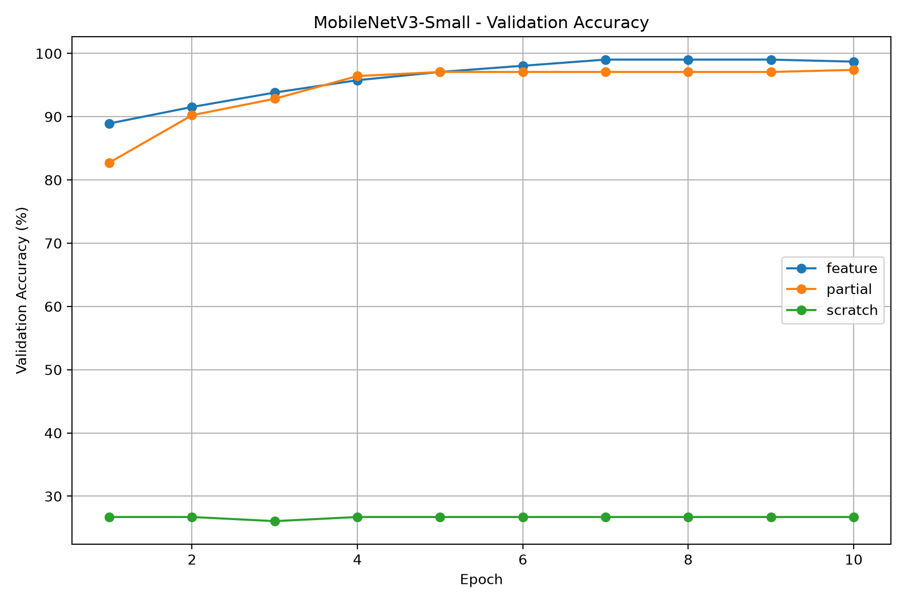

# RET503 P2 — Transfer Learning and Fine-Tuning of Vision Models

## 1. Deskripsi Proyek

Proyek ini merupakan implementasi praktikum P2 mata kuliah RET503 Computer Vision and Deep Learning. Tujuannya adalah membandingkan metode transfer learning dan training dari awal pada model visi komputer untuk klasifikasi komponen elektronik.

Model utama yang digunakan adalah **MobileNetV3-Small**. Eksperimen membandingkan tiga pendekatan, yaitu Feature Extraction, Partial Fine-Tuning, dan Scratch Training, dengan evaluasi pada dataset yang dipisahkan berdasarkan kondisi pencahayaan.

## 2. Tujuan

1. Membangun dataset citra lima kelas objek elektronik.
2. Melakukan koreksi distorsi kamera berdasarkan hasil kalibrasi.
3. Membandingkan tiga strategi pelatihan model visi komputer.
4. Mengevaluasi akurasi training, akurasi validation, loss, dan waktu pelatihan.
5. Mengukur latency inferensi model pada CPU.
6. Menganalisis pengaruh transfer learning terhadap pengenalan objek dalam kondisi pencahayaan berbeda.

## 3. Dataset

Dataset mentah terdiri dari 604 citra RGB yang terbagi dalam lima kelas.

| Kelas | Jumlah Citra |
|---|---:|
| arduino_uno | 99 |
| esp32 | 135 |
| kartu_rfid | 170 |
| kosong | 50 |
| rfid_rc522 | 150 |
| **Total** | **604** |

Seluruh kelas memenuhi ketentuan minimal 50 citra per kelas.

Dataset mentah beserta metadata disimpan di `dataset_raw/`. Metadata mencatat nama file, kelas objek, tanggal, dan kondisi cahaya. Kondisi cahaya yang digunakan dalam eksperimen ini adalah terang dan redup.

### Pembagian Dataset

Training menggunakan citra kondisi terang, sedangkan validation menggunakan citra kondisi redup.

| Kelas | Training (Terang) | Validation (Redup) |
|---|---:|---:|
| arduino_uno | 49 | 50 |
| esp32 | 65 | 70 |
| kartu_rfid | 88 | 82 |
| kosong | 25 | 25 |
| rfid_rc522 | 70 | 80 |
| **Total** | **297** | **307** |

Pembagian ini dirancang untuk menguji kemampuan generalisasi model terhadap perubahan pencahayaan. Oleh karena itu, hasil validation menggambarkan performa pada kondisi redup berdasarkan dataset yang tersedia, bukan jaminan performa pada semua kondisi lingkungan.

### Kalibrasi dan Koreksi Kamera

Kalibrasi kamera dilakukan menggunakan 41 citra checkerboard dengan resolusi 1280 × 720 piksel.

Hasil kalibrasi menunjukkan RMS calibration error sebesar **0,5709 piksel**. Parameter kamera disimpan pada `calib.npz` dan digunakan oleh `correct_images.py` untuk mengoreksi distorsi citra sebelum pembagian dataset dan pelatihan model.

## 4. Model dan Metode Eksperimen

### Model yang Dipilih

MobileNetV3-Small dipilih karena arsitekturnya relatif ringan dan sesuai untuk eksperimen klasifikasi pada CPU serta perangkat komputasi edge.

EfficientNet-B0 dipertimbangkan sebagai kandidat alternatif dengan kebutuhan komputasi lebih tinggi. Pada eksperimen yang dilaporkan dalam repository ini, model yang benar-benar dilatih dan diukur latensinya adalah MobileNetV3-Small.

### Tiga Mode Pelatihan

**1. Feature Extraction**

Bobot pretrained ImageNet dipertahankan pada backbone. Classifier disesuaikan dengan lima kelas dataset dan dilatih menggunakan citra training.

**2. Partial Fine-Tuning**

Bobot pretrained digunakan sebagai titik awal. Sebagian layer akhir bersama classifier dilatih agar fitur model dapat menyesuaikan diri dengan karakteristik citra komponen elektronik.

**3. Scratch Training**

Model dilatih tanpa bobot pretrained ImageNet. Seluruh parameter model dipelajari dari data target untuk membandingkan hasilnya dengan dua pendekatan transfer learning.

Ketiga mode menggunakan 10 epoch pada dataset dan pembagian yang sama agar hasil eksperimen dapat dibandingkan.

## 5. Hasil Training

Berikut ringkasan hasil dari eksperimen terbaru dengan 297 citra training dan 307 citra validation.

| Mode | Akurasi Validation Terbaik | Epoch Terbaik | Epoch Pertama ≥90% | Waktu Training |
|---|---:|---:|---:|---:|
| Feature Extraction | 99,02% | 7 | 2 | 149,79 detik |
| Partial Fine-Tuning | 97,39% | 10 | 2 | 151,67 detik |
| Scratch Training | 26,71% | 1 | Belum tercapai | 196,86 detik |

### Akurasi Validation per Epoch

| Epoch | Feature Extraction | Partial Fine-Tuning | Scratch Training |
|---:|---:|---:|---:|
| 1 | 88,93% | 82,74% | 26,71% |
| 2 | 91,53% | 90,23% | 26,71% |
| 3 | 93,81% | 92,83% | 26,06% |
| 4 | 95,77% | 96,42% | 26,71% |
| 5 | 97,07% | 97,07% | 26,71% |
| 6 | 98,05% | 97,07% | 26,71% |
| 7 | 99,02% | 97,07% | 26,71% |
| 8 | 99,02% | 97,07% | 26,71% |
| 9 | 99,02% | 97,07% | 26,71% |
| 10 | 98,70% | 97,39% | 26,71% |

### Grafik Akurasi

Grafik perbandingan akurasi validation setiap epoch tersedia di:



File riwayat lengkap untuk setiap mode tersedia pada:

- `results/history_feature.csv`
- `results/history_partial.csv`
- `results/history_scratch.csv`

Tabel ringkasan otomatis tersimpan di `results/training_summary.csv`.

## 6. Pengukuran Latency

Pengukuran latency dilakukan pada MobileNetV3-Small mode Feature Extraction dengan perangkat CPU.

| Parameter | Hasil |
|---|---:|
| Perangkat | CPU |
| Ukuran input | 1 × 3 × 224 × 224 |
| Minimum latency | 13,565 ms |
| Rata-rata latency | 16,342 ms |
| Median latency | 16,367 ms |
| P95 latency | 17,430 ms |
| Maksimum latency | 20,854 ms |
| Estimasi FPS | 61,19 |

Hasil pengukuran tersimpan pada `results/latency_summary.csv`.

Estimasi FPS dihitung berdasarkan kebalikan rata-rata latency inferensi. Nilai tersebut menunjukkan kecepatan inferensi model saja; belum mencakup waktu akuisisi kamera, koreksi distorsi, preprocessing, postprocessing, dan komunikasi robot.

Sebagai referensi dalam materi praktikum, target keseluruhan pipeline adalah 15 FPS atau sekitar 66,7 ms per frame. Pengujian pada perangkat target tetap diperlukan untuk memastikan target tersebut tercapai dalam penggunaan nyata.

## 7. Analisis Hasil

### Feature Extraction

Feature Extraction mencapai akurasi validation tertinggi sebesar 99,02% pada epoch 7 dengan waktu pelatihan sekitar 149,79 detik. Hasil ini menunjukkan bahwa bobot pretrained mampu memberikan fitur yang efektif untuk klasifikasi pada dataset ini, termasuk ketika validation menggunakan kondisi cahaya redup.

### Partial Fine-Tuning

Partial Fine-Tuning mencapai akurasi validation terbaik sebesar 97,39% pada epoch 10. Hasilnya cukup tinggi, tetapi masih lebih rendah daripada Feature Extraction dalam eksperimen ini. Membuka sebagian layer untuk dilatih ulang tidak otomatis menghasilkan peningkatan performa; hasilnya juga dipengaruhi ukuran dataset, learning rate, dan variasi citra.

### Scratch Training

Scratch Training hanya mencapai akurasi validation terbaik sebesar 26,71%. Akurasi training meningkat sampai 91,58%, tetapi akurasi validation relatif tidak berubah.

Proporsi kelas terbesar pada validation, yaitu `kartu_rfid`, adalah 82 dari 307 citra atau sekitar 26,71%. Kedekatan angka tersebut dengan akurasi Scratch mengindikasikan kemungkinan model terlalu sering memprediksi kelas tersebut. Hal ini perlu dikonfirmasi melalui pemeriksaan prediksi dan confusion matrix sebelum menarik kesimpulan yang pasti.

### Perbandingan Umum

Pada eksperimen ini, kedua pendekatan transfer learning jauh lebih baik daripada Scratch Training. Feature Extraction menjadi metode terbaik berdasarkan akurasi validation dan waktu pelatihan. Scratch Training menunjukkan kesulitan menyesuaikan diri dengan data validation, meskipun akurasi training terus meningkat.

Hasil validation yang tinggi tetap perlu ditafsirkan secara hati-hati. Dataset ini menguji perpindahan dari kondisi terang ke redup, tetapi belum membuktikan generalisasi pada sesi pengambilan, latar, jarak, dan perangkat kamera lain. Evaluasi tambahan, confusion matrix, serta pemeriksaan citra yang mirip diperlukan untuk memperkuat kesimpulan.

## 8. Struktur Repository

```text
RET503-P2-Transfer-Learning/
├── dataset_raw/
│   ├── metadata.csv
│   ├── arduino_uno/
│   ├── esp32/
│   ├── kartu_rfid/
│   ├── kosong/
│   └── rfid_rc522/
├── models/
│   ├── mobilenet_v3_small_feature.pth
│   ├── mobilenet_v3_small_partial.pth
│   └── mobilenet_v3_small_scratch.pth
├── results/
│   ├── history_feature.csv
│   ├── history_partial.csv
│   ├── history_scratch.csv
│   ├── latency_summary.csv
│   ├── training_summary.csv
│   └── validation_accuracy.png
├── calib.npz
├── correct_images.py
├── split.py
├── train.py
├── latency.py
├── requirements.txt
├── DESAIN_AWAL.md
├── README.md
└── .gitignore
```

Folder `dataset_corrected/` dan `dataset/` merupakan data hasil pemrosesan yang dapat dibuat ulang melalui script dan tidak disertakan sebagai folder terpisah dalam repository GitHub.

## 9. Cara Menjalankan Ulang Eksperimen

Pastikan Python dan dependensi yang tercantum pada `requirements.txt` telah terpasang.

```powershell
py -m pip install -r requirements.txt
py correct_images.py
py split.py
py train.py
py latency.py
```

Perintah training akan menghasilkan kembali file model dan hasil eksperimen dalam folder `models/` dan `results/`. Jalankan training hanya jika ingin mengulang eksperimen.

## 10. Kesimpulan

Berdasarkan eksperimen terbaru, Feature Extraction pada MobileNetV3-Small memberikan hasil terbaik dengan akurasi validation 99,02%, dicapai pada epoch 7, dan waktu training 149,79 detik. Partial Fine-Tuning mencapai 97,39%, sedangkan Scratch Training mencapai 26,71%.

Pengukuran latency Feature Extraction menunjukkan rata-rata 16,342 ms per inferensi pada CPU dengan estimasi 61,19 FPS. Hasil ini memenuhi acuan kecepatan untuk inferensi model secara individual, tetapi kinerja keseluruhan pipeline masih perlu diuji pada perangkat target.

Eksperimen ini menunjukkan manfaat penggunaan pretrained weights pada dataset yang relatif kecil. Evaluasi lanjutan perlu mencakup confusion matrix, pengujian pada variasi sesi dan lingkungan, serta pengukuran keseluruhan pipeline sebelum model digunakan pada robot.

## 11. Berkas Pendukung

- Dokumen desain awal: `DESAIN_AWAL.md`
- Dataset dan metadata: `dataset_raw/metadata.csv`
- Ringkasan tiga mode: `results/training_summary.csv`
- Grafik akurasi validation: `results/validation_accuracy.png`
- Hasil pengukuran latency: `results/latency_summary.csv`
- Bobot model: folder `models/`

Repository: https://github.com/rachmatcahyo1818-bit/RET503-P2-Transfer-Learning